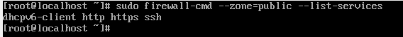

# Question 1

> Create a virtual machine having the os centos
a.	Install firewall in the vm(centos might have firewall installed in default).(firewalld or iptables)


Firewalld is already installed in centos by default but if we need to install it we can use the command 

```
sudo yum install firewalld
```

We can check the status using the command

```
sudo firewall-cmd –state
```


OR

```
sudo systemctl status firwalld
```


---

> b.	Block certain ip range/subnet using firewalld.

To block certain Ip range/subnet we can use the command, here the ip range of 192.168.2.0 - 192.168.2.255 is blocked

```
sudo firewall-cmd --permanent –add-rich-rule=”rule family=’ipv4’ source address=’192.168.2.0/24’ reject”
```


Now the new rule can be seen using the command

```
sudo firewall-cmd --list-all
```


---

> c.	Allow http, https and ssh connection using firewall.

Http, https and ssh are services which can be allowed or blocked, to allow them we can use the following command

```
sudo firewall-cmd --permanent --zone=public --add-service=<service name>
```


We can check the services allowed with the command

```
sudo firewall-cmd –-permanent –-zone=public –-list-services
```


---

> d.	You can add other rules as well as you prefer.
Note: The firewall rules should be saved permanently

We can as well open ports or port range to the zone using the command

```
sudo firewall-cmd --permanent --zone=public --add-port=4040/tcp 
```


I almost all of the above commands --permanent flags were used to set the options permanently, but these options are not effective immediately, obly afffter service restart/reload.
So, we need to use restart the service after these so we need to use the command

```
sudo firewall-cmd --reload
```

So finally, the rules would be 

